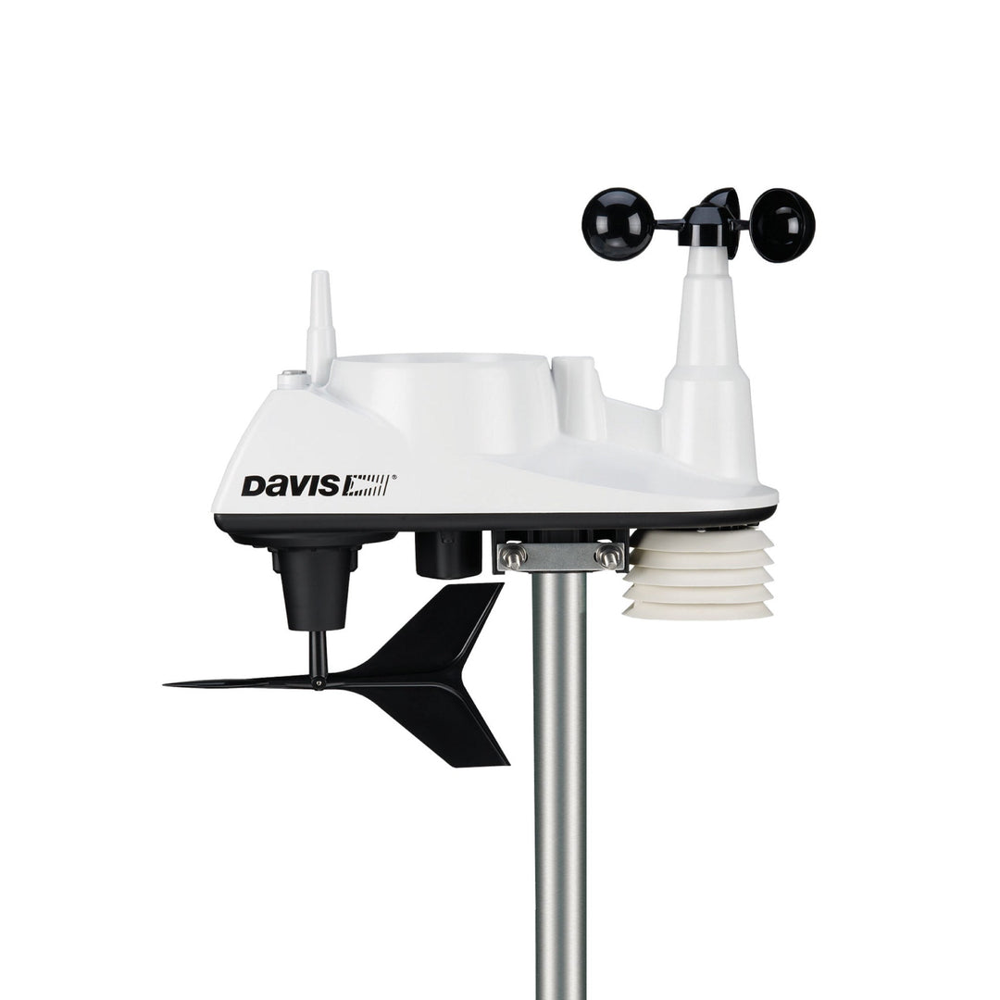
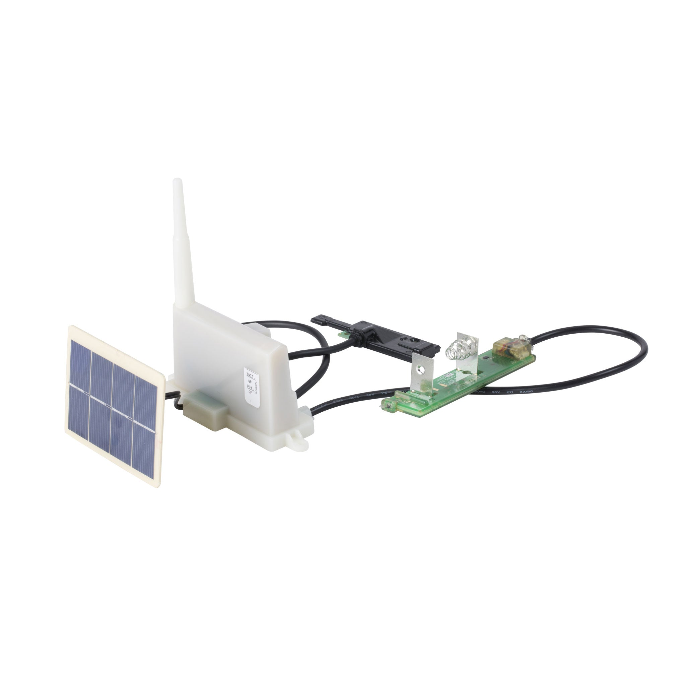
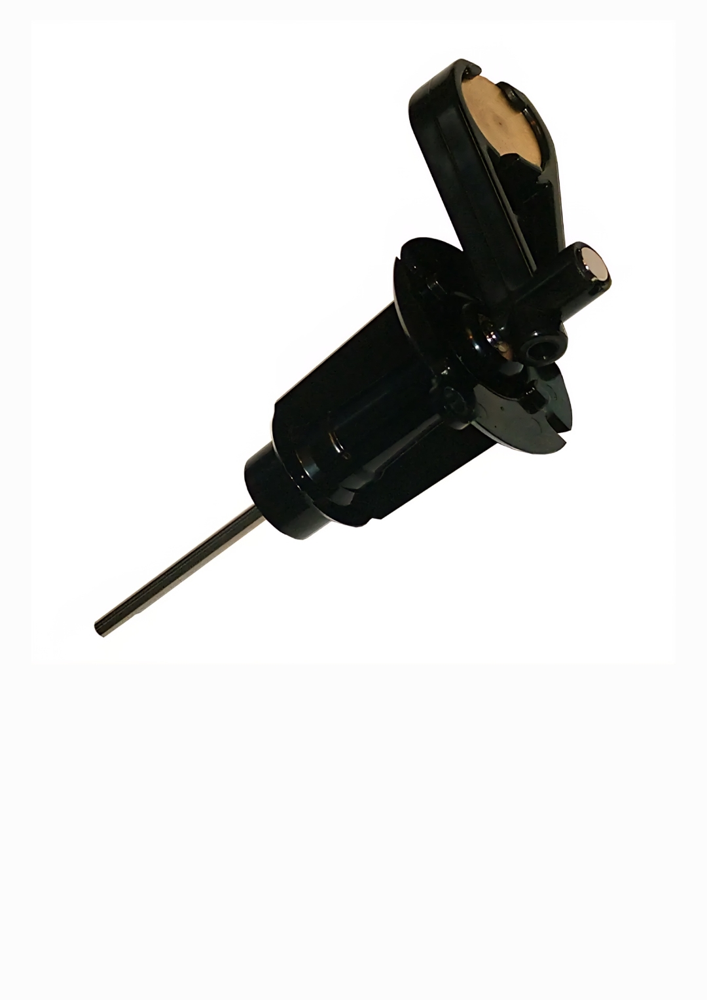
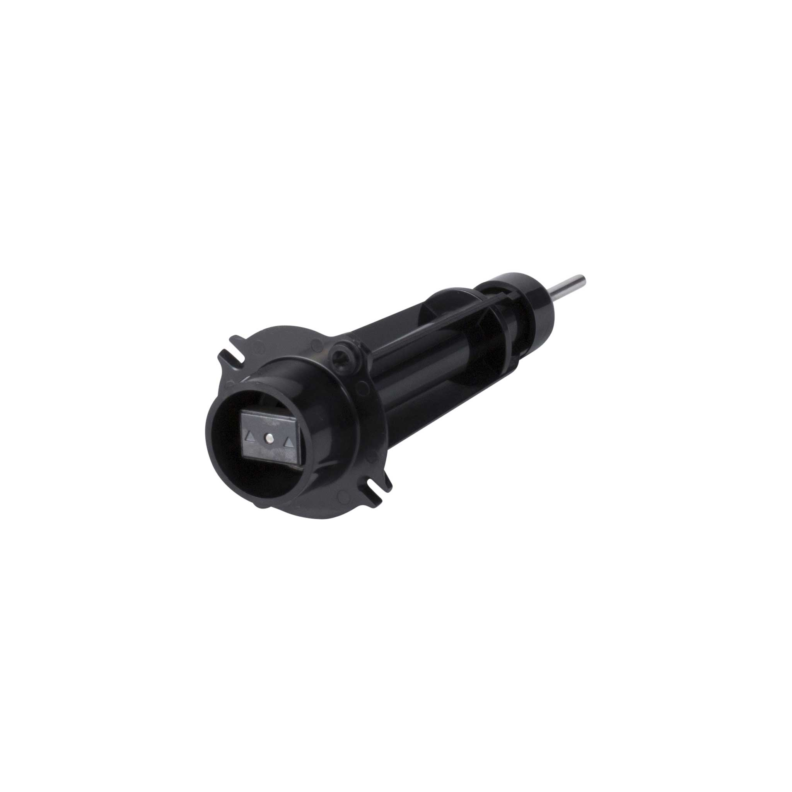
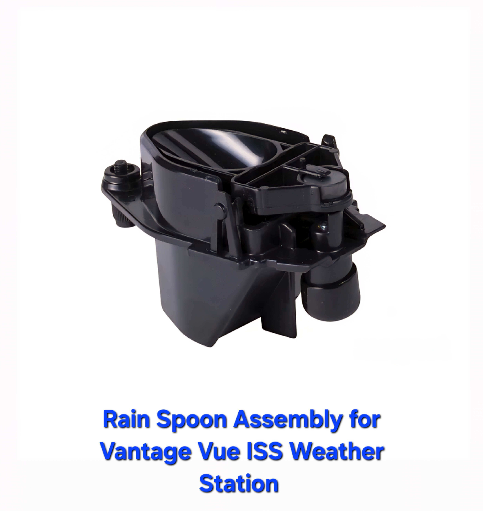

# Custom Davis-Integrated Weather Station (Work in Progress) 

  

## Overview
A modular weather station using Davis mechanical components, Teensy + RFM69 telemetry, and APRS/web integration.  This Project essentially Replaces the harness assembly inside the Davis ISS

  

## Architecture
- Re-use Davis ISS enclosure
- Re-use ISS tipping spoon Rain Sensor
- Teensy-based transmitter with RFM69
- Re-use Magnetic angle sensor for wind direction
- DHT/BME280 for temp/humidity/pressure
- AS3935 Franklin Lightning Sensor
- ESP32 (Web and Internet Gateway)
- Solar + battery + charge controller
- APRS Beacon

## Goals
- Davis packet compatibility
- Engineering telemetry (battery temp, radio temp, enclosure temp, solar cell voltage, battery charge state)
- Robust desert deployment
- Modular, open-source design

## Power System
- Solar input → charge controller → 18650 battery
- Battery → regulators → Teensy, sensors, RF
- Thermal-aware charging and battery monitoring

## RF Stack
- RFM69 with matched antenna
- Davis-compatible hop timing and Manchester encoding
- Fixed packet TX → sensor packet TX → APRS framing

## Mechanical Notes
- Re-use ISS Enclosure and Sensors (Wind Speed, Wind Direction and Rain )
- Locate main Processor+Radio on existing mounts above the magnetic wind direction sensor, which enables the same placement of ISM 915/868MHz vertical antenna
- Need to address sealed electronics enclosure with thermal constraints

## Status
- Receiver test based on VPtools RXtest.ino to validate and decode Davis packets on Teensy 3.x hardware.  (done! 3/14/2026)
- Develop/test a "Packet Sniffer" program to be used to gather Real ISS packets, output in Vebose or  Raw .csv files. (Note: This will also be used to validate the ISS Transmitter via over-the-air capture). The .ino is essentally done! Testing started by gathering ISS packets from a working Davis ISS and and using them to verify a python decoder which will be used to verufy the transmitter. (done! 5/5/26)
- Test all hardware (described below) and drives on packet engine generator. (in progress 5/6/26) 
- Integrate Transmitter software. (not started)
- Test/validate Transmitter software (not started)
- Assemble prototype for Davis ISS tranmitter replacement (not strted)
- Deployment and test with a Davis console (not started) 
  
- Hardware: Breadboard with Teensy 3.2 being used for RX and TX tests. (done! 5/6/26) Uses Teensy 3.2 boards, RFM69HCW 915MHz tranciever module (SPI), helical antennas, AS5048A (SPI version) angle sensor breakout, analog voltage dividers (for Solar and Battery) voltages, a thermistor (for battery or enclosure temp), and a Cds LDR for light levels (may upgrade to UV sensor), Temp, Humidity, and Barometric pressure are done with BME280 ( tbd - upgrade for air quality?),   Switches currently simulate tge hall-effect sensors, and tested with a MOD-1016 lightning sensor breakout (i2c)  ESP32 board and solar charge breakout board tbd.  All drivers and test .ino and drivers are uploaded Will add hardware info and datasheet folders.  (Prototype tested OK: 5/6/26) 

## 1. Core Objectives

- Build a modular weather station using Davis mechanical components
- Replaces Vantage Vu Harness Assembly 
- Upgrade to Integrate with APRS and local web telemetry
- Maintain compatibility with Davis packet format
- Maintains a local Web Weather Page (new)
- Enable engineering telemetry: battery temp, RSSI, charge state, etc. via WiFi (new)
- Design for remote/harsh desert deployment: sealed case, solar power, thermal resilience (new)

## 2. Mechanical Integration

- Use existing Davis ISS enclosure
- The AS5600 12-bit Magnetic encoder must above direction sensor
  

  

  
- Wind Speed uses Vantage Vue Wind Speed Cartridge must mount TI DRV5033 Hall Sensor Switch near magnet.
  

  

- Radome space available for vertical antenna. 

- Tipping spoon rain (Use: TI DRV5033 Hall Sensor Switch)

  

  

  
- Configuration: LED and existing Magnet/switch (Use: TI DRV5033 Hall Sensor Switch)
  
- Solar Charge controller may reuse existing solar panel but power supply must be redesigned to support the new processors.
- NOTE: Limited airflow; thermal management required - replacing low powered Davis Processor

## 3. Proposed Electronics

- **Brain #1**: Teensy 4.x (Real-time Controller)
- **Brain #2**: ESP32 (Web and Internet Gateway) 
- **Radio #1**: RFM69 (Davis-compatible packet timing)
- **Radio #2**: DRA818V (or simular) 2-Meter APRS Tranceiver 144.390 MHz - May be in a second enclosure, with separeate power supply. 
- **New Sensors**: DHT/BME280 for temp/humidity/pressure + AS3935 Franklin Lightning Sensor
- **Wind Direction**: Uses  Angle Sensor AS5600 or AS5048 using Davis magnet direction sensor
- **Power**: Use existing Solar Panel with 18650 Li-ion battery + solar charge controller
- **Telemetry**: APRS gateway + local web server

## 4. Power System

- Solar panel input
- Charge controller with thermal-aware logic
- 18650 battery (monitor temperature and voltage)
- Regulated 3.3V/5V rails for MCU, RF, sensors
- Engineering page shows battery temp, charge state, current draw

## 5. RF and Telemetry

- RFM69 transmitter with matched antenna
- Fixed packet → sensor packet → APRS framing
- Teensy receiver already validated
- Antenna options: helical, whip, case-mounted vertical

## 6. Development Plan

- Start with fixed packet TX
- Add sensors and telemetry
- Test magnetic angle sensor under vane magnet
- Build power block and thermal model
- Create engineering page for diagnostics
- Version libraries and document builds

## 7. Notes

- Enclosure must protect electronics from heat and moisture
- Battery life and thermal stress are key constraints
- Modular design allows future upgrades (e.g., LiFePO₄, MPPT, additional sensors)
